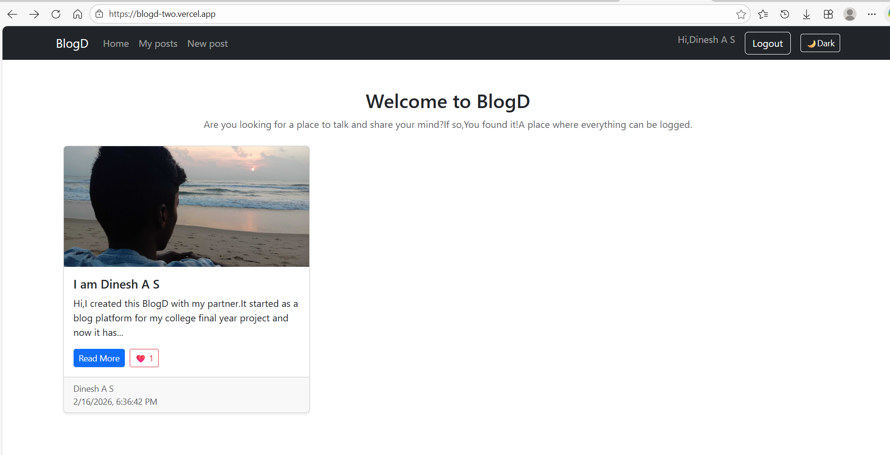
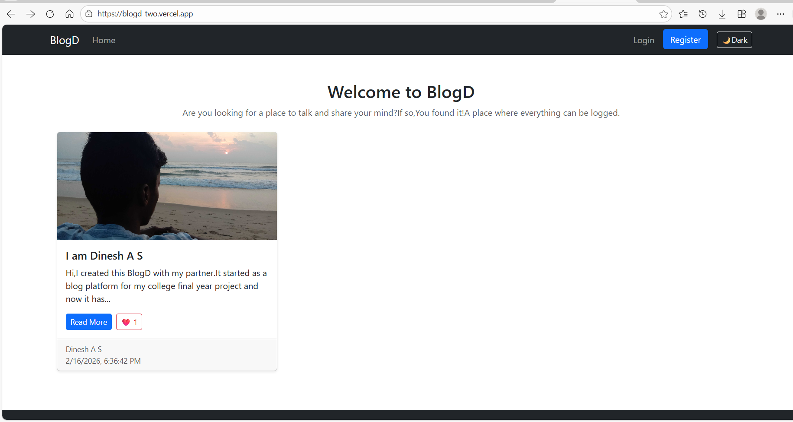
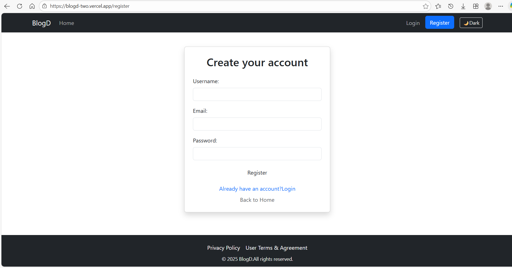
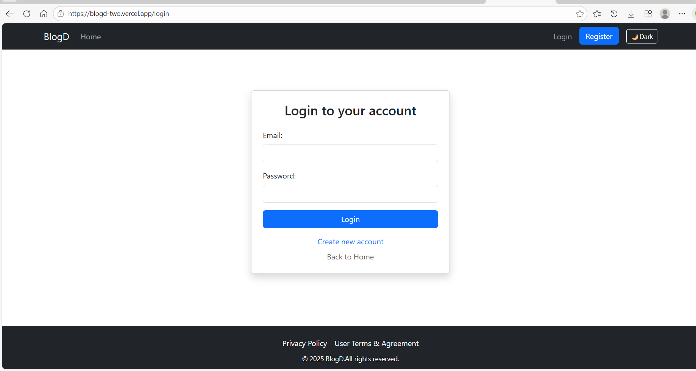

 ## BlogD—Full Stack Blog Platform

BlogD is a full-stack blogging web application built as a final year college project.It allows users to create,edit and delete posts,upload images,like posts and comment all within a secure user authentication system.

This project started as a simple blog and evolved into a complete full stack application.

## Features

- User authentication (Register / Login / Logout)

- Create,edit, and delete blog posts

- My posts dashboard

- Image upload with Cloudinary

- Like and comment system

- Dark Mode

## Tech Stack

### Frontend

- React
- Bootstrap

### Backend

- Node.js
- Express.js

### Deployment

Frontend: Vercel

Backend: Render

Database: MongoDB Atlas

Image storage: Cloudinary

## Installation and Setup

git clone https://github.com/dineshasoffl/blogd.git

cd blog-project

### Backend setup

cd blogd-backend

npm install

npm start

### Frontend setup

cd blogd-client

npm install

npm run dev

## Enviroment Variables

## Environment Variables

Create a `.env` file in the backend root:

MONGO_URI=your_mongodb_connection_string␣␣  
SESSION_SECRET=your_secret␣␣  
CLOUDINARY_CLOUD_NAME=your_cloud_name␣␣    
CLOUDINARY_API_KEY=your_api_key␣␣  
CLOUDINARY_API_SECRET=your_api_secret␣␣  

## Future Improvements

- User profiles

- Search functionality

- Notifications

- Rich text editor

## Deployment Links

Frontend(Vercel):https://blogd-two.vercel.app/

Backend(Render):https://blogd-backend.onrender.com

## Screenshots

### Home Page 

### Blog Page

### Likes and COmments

### New Post

### My Posts

### Edit Post

### Delete Post

### Register

### Login

### Dark Mode

